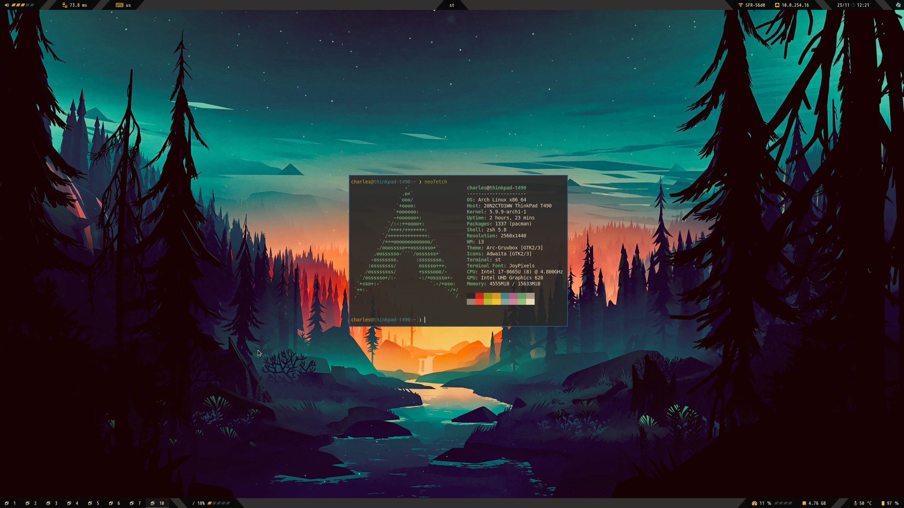
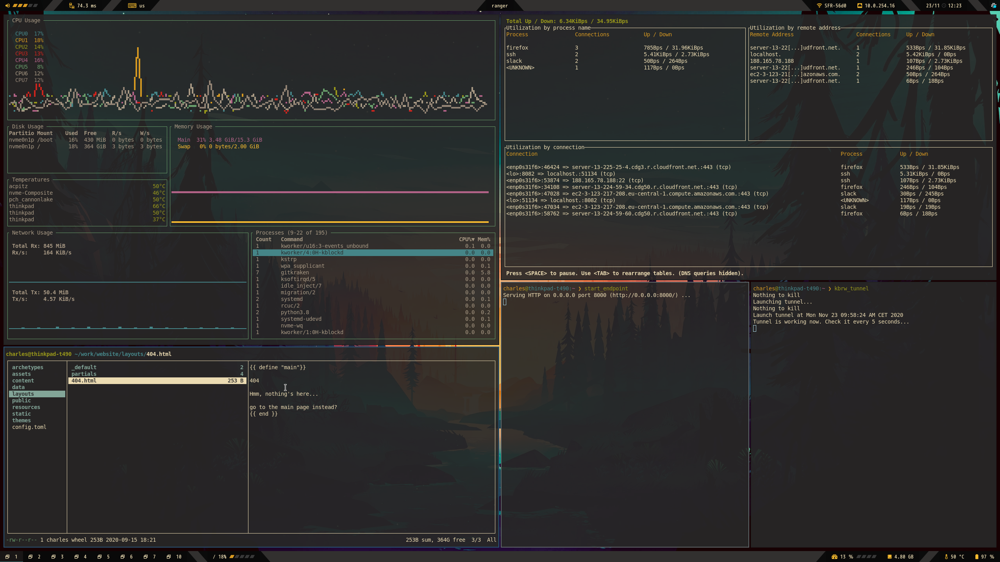
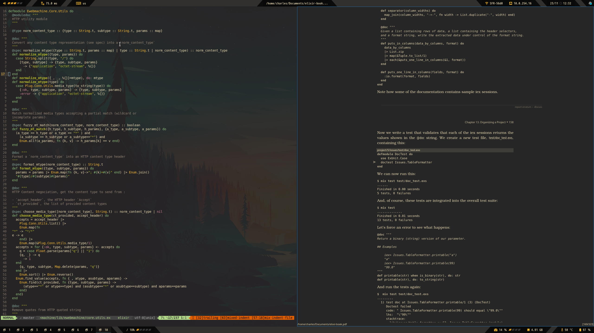
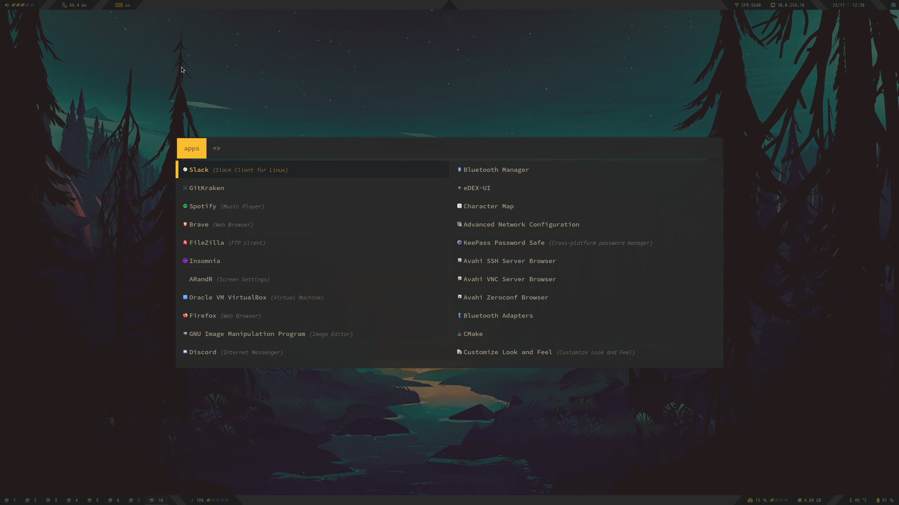
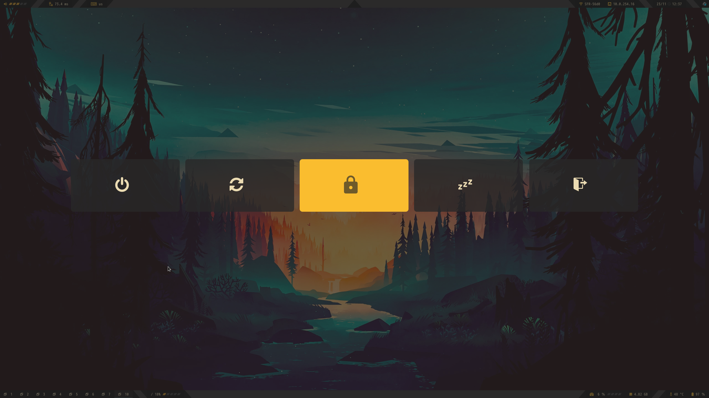
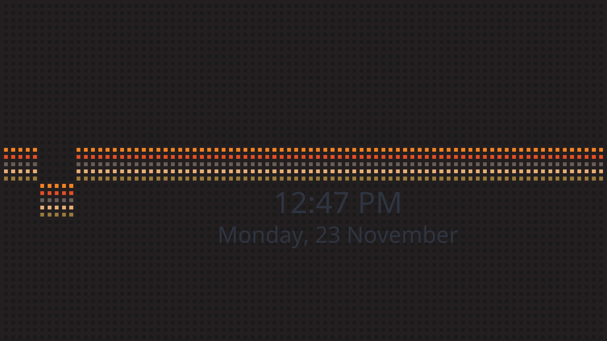

Git repository containing most of my dotfiles for Linux/GNU OS

# Screenshots

  
Clean

  

  
System information

  

  
Firefox

  

  
Monitoring

  

  
Nvim and Zathura

  

  
Rofi appmenu

  

  
Rofi powermenu

  

  
Lockscreen

  

