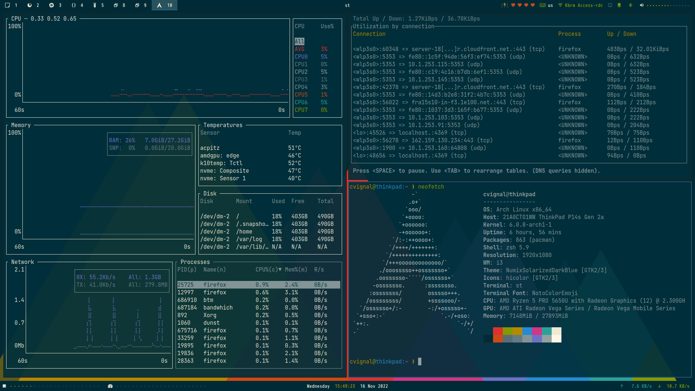
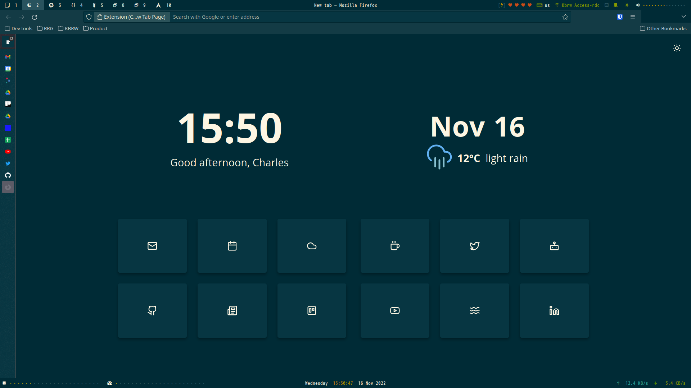
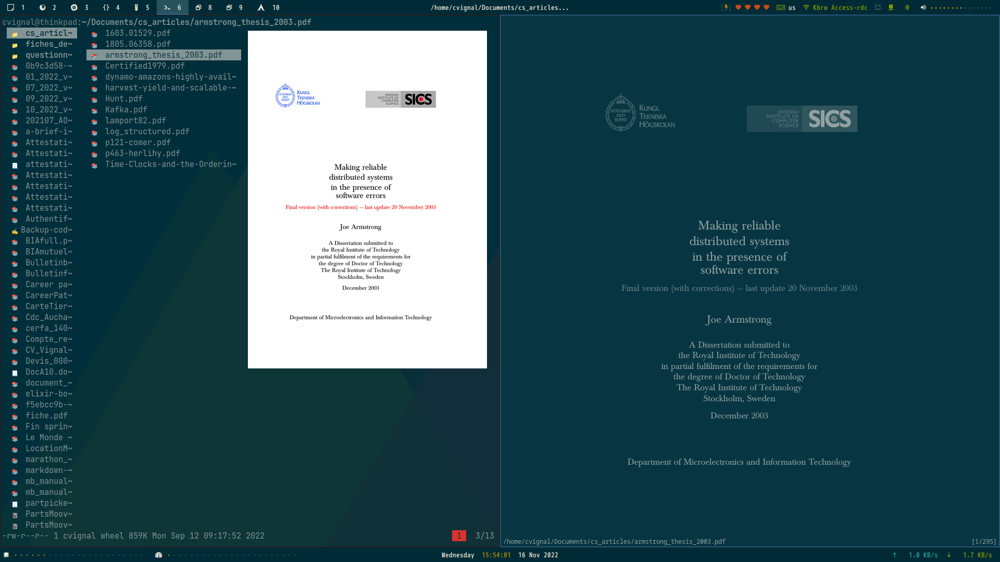
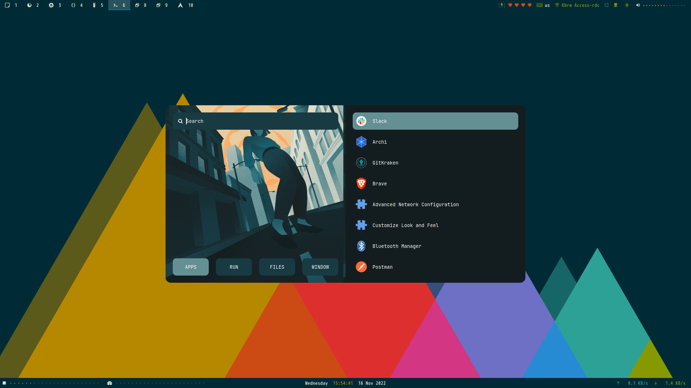
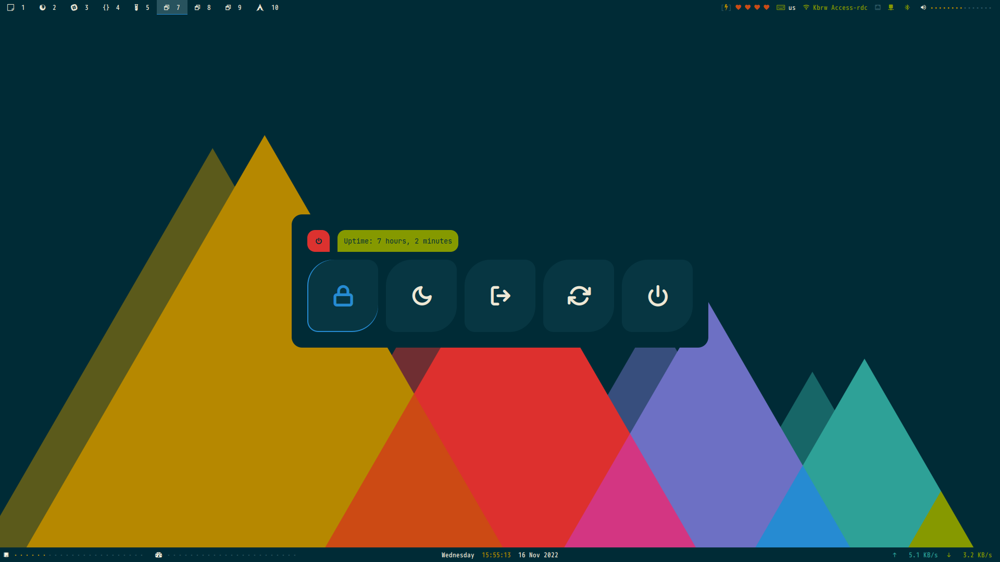

Git repository containing most of my dotfiles for Linux/GNU OS

# Screenshots

  
Clean

  

  
Terminal based apps

  

  
Firefox

  

  
Nvim

  

  
File manager and zathura

  

  
Launcher

  

  
Powermenu

  

